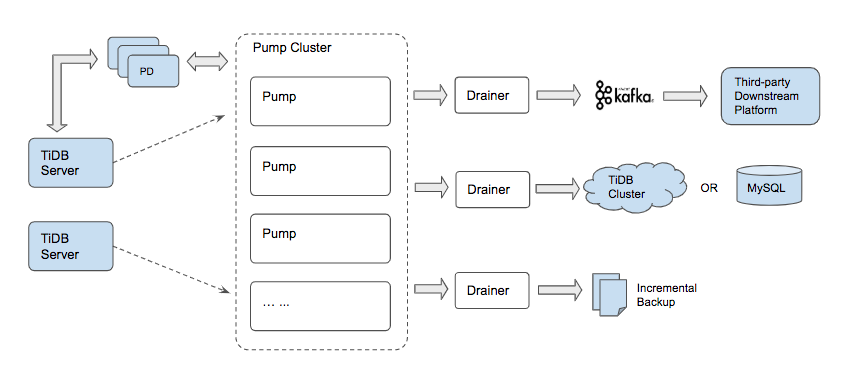

# TiDB-Binlog

[](https://internal.pingcap.net/idc-jenkins/job/build_tidb_binlog_master/)
[](https://coveralls.io/github/pingcap/tidb-binlog?branch=HEAD)
[](https://goreportcard.com/report/github.com/pingcap/tidb-binlog)

## TiDB-Binlog introduction

TiDB-Binlog is a tool used to collect [TiDB's](https://github.com/pingcap/tidb) binary logs with the following features:

- Data replication
    
    Synchronize data from the TiDB cluster to heterogeneous databases.

- Real-time backup and recovery
    
    Backup the TiDB cluster into the Dump file and it can be used for recovery.

- Multiple output format
    
    Support MySQL, Dump file, etc.
    
- History replay
    
    Replay from any history point.

## Documentation
+ [Detailed documentation](https://pingcap.com/docs/tools/tidb-binlog-cluster/)
+ [简体中文](https://pingcap.com/docs-cn/tools/tidb-binlog-cluster/)

## Architecture



## Service list

[Pump](./cmd/pump)

Pump is a daemon that receives real-time binlogs from tidb-server and writes in sequential disk files synchronously.

[Drainer](./cmd/drainer)

Drainer collects binlogs from each Pump in the cluster, transforms binlogs to various dialects of SQL, and applies to the downstream database or filesystem.

## How to build

To check the code style and build binaries, you can simply run:

```
make build   # build all components
```

If you only want to build binaries, you can run:

```
make pump  # build pump

make drainer  # build drainer
```

When TiDB-Binlog is built successfully, you can find the binary in the `bin` directory. 

## Run Test

Run all tests, including unit test and integration test

```
make test
```
See [tests](./tests/README.md) for how to execute and add integration tests.

## Deployment

The recommended startup sequence: PD -> TiKV -> [Pump](./cmd/pump) -> TiDB -> [Drainer](./cmd/drainer)

The best way to install TiDB-Binlog is via [TiDB-Binlog-Ansible](https://www.pingcap.com/docs-cn/tools/tidb-binlog-cluster/)

## Tutorial

Here's a [tutorial](https://www.pingcap.com/docs/dev/how-to/get-started/tidb-binlog/) to experiment with TiDB-Binlog (not for production use).

## Config File
* Pump config file: [pump.toml](./cmd/pump/pump.toml) 
* Drainer config file: [drainer.toml](./cmd/drainer/drainer.toml) 

## Contributing
Contributions are welcomed and greatly appreciated. See [CONTRIBUTING.md](./CONTRIBUTING.md)
for details on submitting patches and the contribution workflow.

## License
TiDB-Binlog is under the Apache 2.0 license. See the [LICENSE](./LICENSE) file for details.
